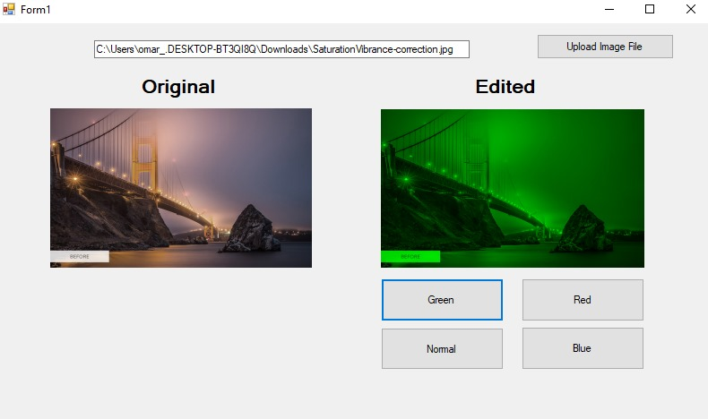
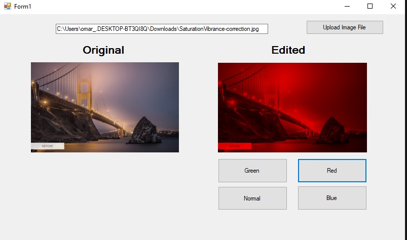
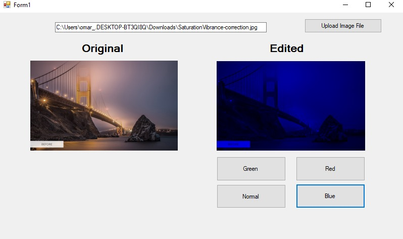
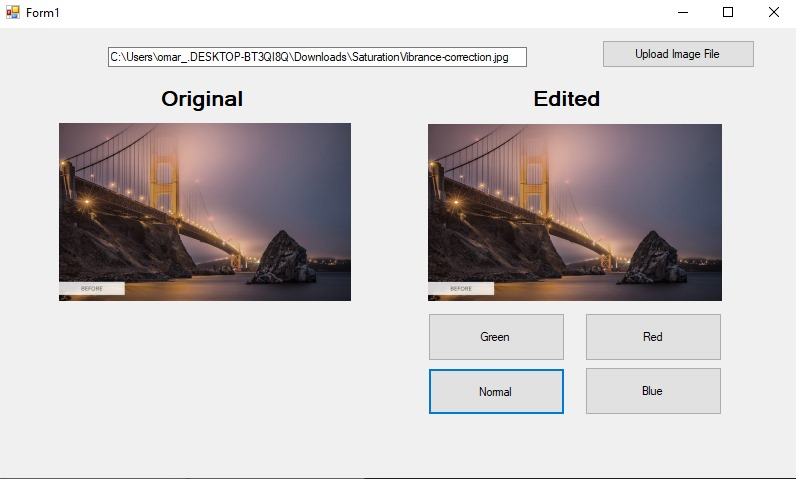

# Simple Image Editing Application using C# 
Simple Image Editing Application
To use this solution , you need to restore the Nuget Packages first
1. Goto Solution Explorer and Right Click, 
2. Click on "Restore NuGet Packages"
3. Build as x64 Platform
4. Run the application

#### Looks

<table>
  <tr>
      <td></td>
      <td></td>
      <td></td>
      <td></td>
  </tr>
</table>

